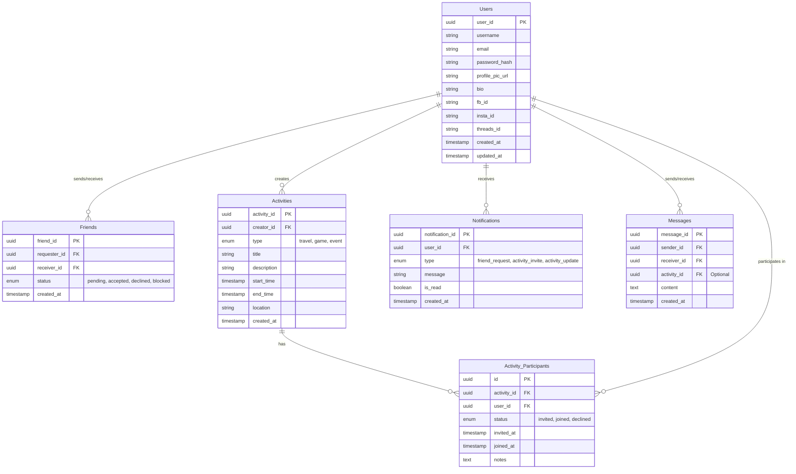

# Database Schema & Entity-Relationship Diagram (ERD)

This document visualizes the database schema designed for the Welldone application, detailing entities, relationships, and data flow.

## Entity-Relationship Diagram

## Real-Time Data Flow

1.  **Friend Requests**:
    *   User A sends a request -> Insert into `Friends` table (status: pending).
    *   **Trigger**: System creates a `Notification` for User B (type: friend_request).

2.  **Activity Invites**:
    *   User A creates an `Activity`.
    *   User A invites User B -> Insert into `Activity_Participants` (status: invited).
    *   **Trigger**: System creates a `Notification` for User B (type: activity_invite).

3.  **Real-time Updates**:
    *   Frontend subscribes to a WebSocket channel for the specific `user_id`.
    *   When a new row is inserted into `Notifications`, the payload is pushed to the client instantly.
